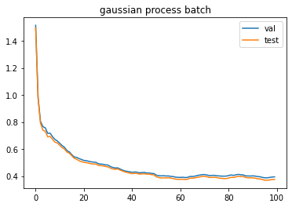
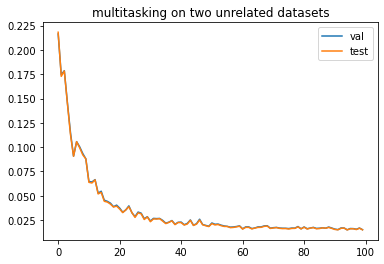

1. Batch active learning for drug target gene discovery:
   In our original plan, we want to build a regression model that can accurately predict all possible target genes of a given drug. However the datasets provided by gene disco is not very satisfying. The drug effects $y$ on all genes are measured by CRISPR screens while the descriptors of every gene comes from different experiments such as the Achilles project or the STRING database. There is almost no correlation between the given feature and the target drug effect. Therefore the best results achieved by linear regression or gaussian process regression is simply output 0. In order to get more interpretable and controllable results, we decided to create our own datasets.  

2. We built datasets of our own. Each data point $(x, y)$. $x \in \mathbb{R}^9$ is sampled from $N(0, \Sigma^2)$. Here $\Sigma^2 = \begin{bmatrix}
   1 & 0.1 & 0.1 & 0 & 0 & 0 & 0 & 0 & 0\\
   0.1 & 1 & 0.1 & 0 & 0 & 0 & 0 & 0 & 0\\
   0.1 & 0.1 & 1 & 0 & 0 & 0 & 0 & 0 & 0\\
   0 & 0 & 0 & 1 & 0.1 & 0.1 & 0 & 0 & 0\\ 
   0 & 0 & 0 & 0.1 & 1 & 0.1 & 0 & 0 & 0\\ 
   0 & 0 & 0 & 0.1 & 0.1 & 1 & 0 & 0 & 0\\ 
   0 & 0 & 0 & 0 & 0 & 0 & 1 & 0.1 & 0.1\\ 
   0 & 0 & 0 & 0 & 0 & 0 & 0.1 & 1 & 0.1\\ 
   0 & 0 & 0 & 0 & 0 & 0 & 0.1 & 0.1 & 1\\
   \end{bmatrix}$. $y=\Sigma_i \text{sigmoid}(<x, w_i>) + \epsilon$. The weights $w_i$ are sampled from $\text{Uniform}[-5, 5]$. A 2D version of the dataset is shown below:

   
   The reason for designing such kind of dataset is because the sigmoid function causes the data points to have different amount of information. Only the points on the boundary is informative. In this way, active learning can perform much better than random sampling. By adding up several different sigmoids, the landscape of $y$ could be very complex. We use a gaussian process regressioner with RBF kernel instead of using linear regression because the data is not linear. Active learning is achieved by picking the data points of the highest variation predicted by the gaussian process model. Besides, we also designed a neural network model that is heavy bias to the dataset. The neural network consists of 3 layers of fully connected layers. The activation of the first layer is ReLU and the activation of the second layer is sigmoid. In this way, the neural network may fit the data perfectly. 

3. small dataset, which is simply the sum of two sigmoid functions. As shown in the figure, active learning showed much better results than random. In order to make the learning process into a batch wise manner, we train the gaussian process model again with the picked data point and the predicted value. Then we choose the next data point with the largest variance. As shown in the figure below, batch active learning has about the same performance as the querying all points one by one. Finally we changed the regressioner to the neural network model. A gaussian process model is also trained aside to estimate the variance for each point. As expected, the neural network model achieved much smaller mse.  
     

4. A more complex dataset, which is the sum of six sigmoids. The results are similar to the results on the simpler dataset. 
   

5. feature selection. Since the performance of Gaussian process depends heavily on measure of distance, we may get better results if we increase the weight of important features. To do so, we first calculate the pearson score $p$ of each feature with the target. Then $p$ is normalized by $\frac{p}{mean(p)}$. The original feature $x$ is then multiplied by $diag(\frac{p}{mean(p)})$. Results showed that for gaussian process, feature selection has a significant improve on performance. However for the neural network model, there is no difference. This is expected because the first layer of the neural network may serve as a feature selection step. Therefore, neural networks may carry out feature selection by itself and no explicit feature selection is necessary.
   
   

6. multitasking. We then tried to carry out regression on two datasets on the same feature set simultaneously. Each dataset is the sum of two sigmoids. This could be very meaningful, because we may want to test the target gene of several drugs. However, to acquire a animal model of a gene could be very costly. Therefore, we may want to build fewer animal model to reduce budget and carry out experiments of all drugs on every model. On every step we may chose a set of data points and get the target value for both datasets. In the first experiment, the two dataset share one same sigmoid and in the second experiment, the sigmoids in two datasets are completely different. As shown in the figures, there is little difference between two experiments. The two related datasets have sightly better performance during the first few rounds. 

   

